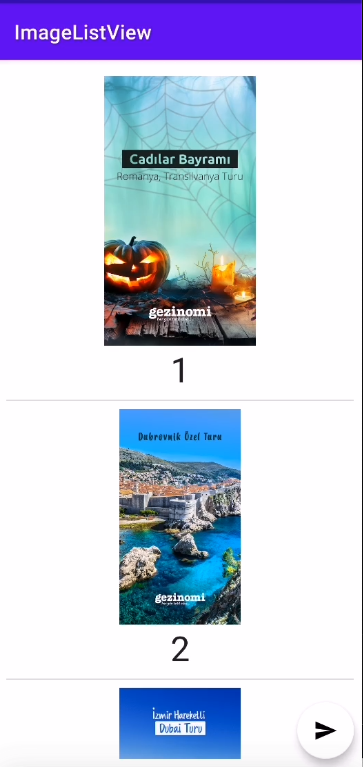

# **ImageListView**
A custom View extends from RecylerView. ImageListView takes list of images and logs the loading times of the images. Implemented in Kotlin.
## ImageListView Methods (from [ImageListView](/app/src/main/java/com/example/imagelistview/view/presentation/ImageListView.kt)):

* #### Set image list from JSON file

```kotlin
  fun setImageListFromJson(fileName: String)
```

| Parameter | Type     | Description                |
| :-------- | :------- | :------------------------- |
| `fileName`| `string`| **Required**. File name of the local JSON file. |

* #### Send image loading times to the service

```kotlin
  fun submitImageListLoadingTimes()
```

## Dependencies Used
In `build.gradle(app)`:
```kotlin
    //Glide
    implementation "com.github.bumptech.glide:glide:4.13.0"
    annotationProcessor "com.github.bumptech.glide:compiler:4.13.0"
    
    //Coroutines
    implementation "org.jetbrains.kotlinx:kotlinx-coroutines-android:1.6.0"
    implementation "org.jetbrains.kotlinx:kotlinx-coroutines-core:1.5.2"

    //Retrofit
    implementation "com.squareup.retrofit2:retrofit:2.9.0"
    implementation "com.squareup.retrofit2:converter-gson:2.9.0"
    implementation "com.squareup.okhttp3:logging-interceptor:5.0.0-alpha.2"
    implementation "com.google.code.gson:gson:2.8.8"

```
## ImageListView Implementation
### Get Image list
JsonParser (from [JsonParser](/app/src/main/java/com/example/imagelistview/view/util/JsonParser.kt)) used to parse JSON data and sets the adapter of the view.
```kotlin
  fun setImageListFromJson(fileName: String) {
        imageList = getJsonDataFromAsset(context, fileName)
        adapter = ImageListAdapter(imageList)
    }
  ```
### Load Image from Url:
Glide used to load image from url. Also,shows placeholder when loading, it loads image from cache if it exits.
Glide can be accessed thourough </br>
`loadImageWithGlide(ctx: Context,itemImageDataModel: ImageDataModel?,loadingTimes: MutableList<Long> ?)` (in [Glide](/app/src/main/java/com/example/imagelistview/view/util/Glide.kt)) </br>
to load images into **ImageListView** and logs the loading time of the images. Used in `ImageListAdapter.ImageListViewHolder.kt` to load image items.
```kotlin
    fun ImageListAdapter.ImageListViewHolder.loadImageWithGlide(
    ctx: Context,
    itemImageDataModel: ImageDataModel?,
    loadingTimes: MutableList<Long> ?
) {
    val begin = System.currentTimeMillis()
    Glide.with(ctx)
        .load(itemImageDataModel?.imageUrl)
        .placeholder(R.drawable.loading_placeholer)
        .override(Target.SIZE_ORIGINAL)
        .listener(object : RequestListener<Drawable> {
            override fun onLoadFailed(
                p0: GlideException?,
                p1: Any?,
                p2: com.bumptech.glide.request.target.Target<Drawable>?,
                p3: Boolean
            ): Boolean {
                Log.e(
                    "Image Loading Time",
                    "Image Loading Time of No: ${itemImageDataModel?.imageId} Failed"
                )
                return false
            }

            override fun onResourceReady(
                p0: Drawable?,
                p1: Any?,
                p2: com.bumptech.glide.request.target.Target<Drawable>?,
                p3: DataSource?,
                p4: Boolean
            ): Boolean {
                val end = System.currentTimeMillis()
                Log.d(
                    "Image Loading Time",
                    "Image Loading Time of No: ${itemImageDataModel?.imageId}: ${end - begin} milliseconds"
                )
                loadingTimes?.add(end - begin)
                return false
            }
        })
        .into(binding.simpleImgView)
}

```
Example log of the loading times:
```kotlin
com.example.imagelistview D/Image Loading Time: Image Loading Time of No: 1: 153 milliseconds
com.example.imagelistview D/Image Loading Time: Image Loading Time of No: 2: 110 milliseconds
com.example.imagelistview D/Image Loading Time: Image Loading Time of No: 3: 101 milliseconds
com.example.imagelistview D/Image Loading Time: Image Loading Time of No: 4: 93 milliseconds
com.example.imagelistview D/Image Loading Time: Image Loading Time of No: 5: 86 milliseconds
com.example.imagelistview D/Image Loading Time: Image Loading Time of No: 6: 101 milliseconds
com.example.imagelistview D/Image Loading Time: Image Loading Time of No: 7: 119 milliseconds
com.example.imagelistview D/Image Loading Time: Image Loading Time of No: 8: 140 milliseconds
com.example.imagelistview D/Image Loading Time: Image Loading Time of No: 9: 171 milliseconds
```

-----

### Send image loading times to the endpoint:
Retrofit used to send image loading times from the **ImageListView** to the service.
Base url : [httbin.org](https://httpbin.org/)
* **Coroutines** are used to make network calls to send loading times asynchronously from the ImageListView to the service. Shows toast message according to the response status.


Reach api service from `RetrofitClient().getMyApi()`
#### Submit image list loading times(from [ImageListView](/app/src/main/java/com/example/imagelistview/view/presentation/ImageListView.kt))
```kotlin
fun submitImageListLoadingTimes() {
        //Send request
        runBlocking {
            showToast(imageListRepository.postLoadingTimes(getLoadingTimes()))
        }
    }
```
## DemoPage([DemoPage](/app/src/main/java/com/example/imagelistview/DemoPage.kt))
A sample Activity that has ImageListView and Button that calls `submitImageListLoadingTimes()`.
To use ImageListView :
* Get the ImageListView from layout.
  ` private fun getImageListView() = binding.imageListView`
```kotlin
//Get imageListView
        val imageListView = getImageListView()
```
* To use ImageListView :
  Set button click listener with ImageListView's `submitImageListLoadingTimes()`
```kotlin
private fun setSubmitButtonOnClickListener (imageListView: ImageListView){
        val submitButton = getSubmitButton()
        submitButton.setOnClickListener {
            imageListView.submitImageListLoadingTimes()
        }
    }
```
Get image URL's from the local [image-list.json](app/src/main/assets/image-list.json)
```kotlin
       imageListView.apply {
            //Set image list from local json.
            setImageListFromJson("image-list.json")
            //Call submit list.
            setSubmitButtonOnClickListener(this)
        }
```

